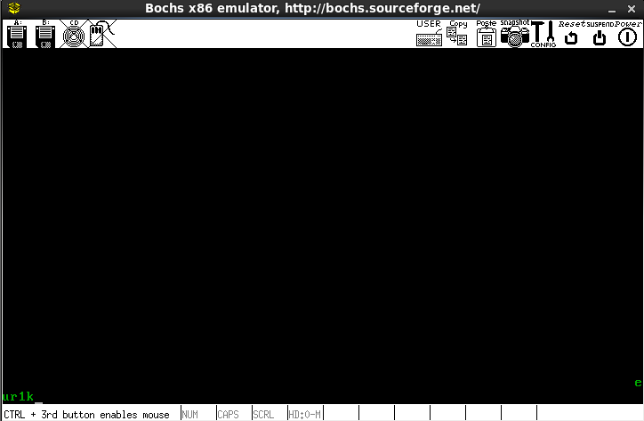

本项目会根据操作系统真象还原实现一个完整的操作系统，预计10月底完成

## 2021.9.8

完成MBR引导系统的初步编写

```
# 配置文件
megs :32
romimage: file=/home/eur1ka/bochs/share/bochs/BIOS-bochs-latest
vgaromimage: file=/home/eur1ka/bochs/share/bochs/VGABIOS-lgpl-latest
boot: disk
log: bochs.out
mouse: enabled=0
keyboard_mapping: enabled=1, map=/home/eur1ka/bochs/share/bochs/keymaps/x11-pc-us.map
ata0: enabled=1, ioaddr1=0x1f0, ioaddr2=0x3f0, irq=14
ata0-master: type=disk, path="eur1ka.img", mode=flat, cylinders=121, heads=16, spt=63

# gdbstub: enabled=1, port=1234, text_base=0, data_base=0, bss_base=0
```


